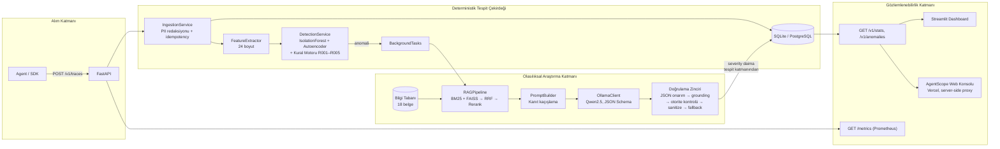

# AgentScope

**AI Agent Yürütmeleri için Anomali Tespiti ve Kanıta Dayalı Soruşturma Platformu**

*(Backend/API bileşeni `agentguard` adını korur; kullanıcıya açık web konsolu **AgentScope** markası altında sunulur.)*

---

## Yönetici Özeti

AgentScope, otonom AI agent yürütmelerinde anormal davranışları gerçek zamanlı olarak tespit eden, tespit edilen anomalilerin kök nedenini hibrit bir RAG (Retrieval-Augmented Generation) ve reranking mimarisiyle araştıran, ardından yerel olarak barındırılan bir LLM (Qwen / Ollama) aracılığıyla kanıta dayalı, yapılandırılmış soruşturma raporları üreten uçtan uca bir güvence platformudur.

Sistem, deterministik bir tespit çekirdeği (kural motoru + IsolationForest + Autoencoder) ile olasılıksal bir araştırma katmanını (RAG + LLM) net bir sorumluluk ayrımıyla birleştirir: nihai önem derecesi (severity) her zaman deterministik tespit katmanından gelir; LLM yalnızca açıklama ve bağlamsallaştırma görevi üstlenir. Bu tasarım kararı, sistemin denetlenebilirliğini ve tutarlılığını doğrudan güvence altına alır.

Tam teknik tasarım dokümantasyonu için bkz. [`docs/TECHNICAL_PLAN.md`](docs/TECHNICAL_PLAN.md).

---

## Temel Yetenekler

| Alan | Açıklama |
|---|---|
| **Gerçek zamanlı tespit** | 24 boyutlu özellik uzayında IsolationForest + Autoencoder füzyonu, 5 deterministik kural (R001–R005) |
| **Kök neden analizi** | BM25 + FAISS hibrit retrieval, RRF füzyonu, cross-encoder reranking ile 18 belgelik operasyonel bilgi tabanından kanıt toplama |
| **Yerel LLM soruşturması** | Qwen2.5 (Ollama üzerinden), yapılandırılmış JSON şema çıktısı, çok katmanlı doğrulama (guard) zinciri |
| **Kurumsal gözlemlenebilirlik** | Prometheus metrikleri, Streamlit iç dashboard'u, Next.js tabanlı AgentScope web konsolu |
| **Güvenlik ve dayanıklılık** | Prompt-injection savunması, IP bazlı hız sınırlama, salt-okunur container'lar, PII redaksiyonu |
| **Veri gizliliği** | Embedding, reranking ve LLM çıkarımı tamamen yerel altyapıda çalışır — üçüncü taraf API bağımlılığı yoktur |

---

## Sistem Mimarisi



Modüller arası bağımlılık yönü CI'da `import-linter` ile zorunlu kılınır: `api → services → (anomaly | rag | llm) → features → schemas`. `schemas` katmanı hiçbir iç modüle bağımlı değildir; `rag` katmanı `anomaly` katmanına asla bağımlı olamaz.

---

## Proje Durumu

Geliştirme, `docs/TECHNICAL_PLAN.md` §26 Yol Haritası'nda tanımlanan sırayla, milestone bazlı olarak yürütülmüştür. Tüm çekirdek milestone'lar (M0–M8) tamamlanmıştır.

| Milestone | Kapsam | Durum |
|---|---|---|
| **M0** | Repo iskeleti, `pyproject.toml`, ruff/mypy/import-linter, pre-commit, CI, health-check uçları | ✅ Tamamlandı |
| **M1** | Pydantic şemaları, `POST /v1/traces` (+batch), idempotency, PII redaksiyonu, SQLAlchemy + Alembic, sentetik veri üretici (10k+ trace) | ✅ Tamamlandı |
| **M2** | 24 boyutlu özellik çıkarıcı, IsolationForest baseline, 5 kural motoru, eşik seçimi, model registry | ✅ Tamamlandı |
| **M3** | Denoising Autoencoder, iki aşamalı temizlik, ECDF kalibrasyonu, füzyon ağırlık optimizasyonu | ✅ Tamamlandı |
| **M4** | 18 belgelik bilgi tabanı, hibrit BM25+FAISS retrieval, RRF füzyonu, cross-encoder reranker | ✅ Tamamlandı |
| **M5** | `OllamaClient`, prompt-injection savunması, çok katmanlı doğrulama zinciri, soruşturma servisleri | ✅ Tamamlandı |
| **M6** | Gözlemlenebilirlik API'leri, retrieval debug uçları, 4 sayfalık Streamlit dashboard | ✅ Tamamlandı |
| **M7** | Hız sınırlama, CORS politikası, container sertleştirme, retrieval ablation raporu, prompt-injection snapshot testi | ✅ Tamamlandı |
| **M8** | Next.js tabanlı AgentScope web konsolu, kurumsal marka kimliği, Vercel dağıtım desteği | ✅ Tamamlandı |

### Öne Çıkan Teknik Notlar

Geliştirme sürecinde tespit edilen ve giderilen kritik bulgular şeffaflık amacıyla aşağıda özetlenmiştir:

- **M6 — İzolasyon eksikliği:** Reindex arka plan görevi, patch'lenmemiş `get_settings()` çağrısı nedeniyle paylaşılan bir yola gerçek bir FAISS index yazıyordu; bu durum `monkeypatch.setenv` ve `get_settings.cache_clear()` ile giderilmiştir.
- **M7 — Tip çözümleme hatası:** `slowapi`'nin `@limiter.limit()` dekoratörü, sarmalanan fonksiyonun değil kendi modülünün bağlamını taşıdığından, `from __future__ import annotations` açıkken FastAPI tiplerini çözemiyordu; ilgili router dosyalarında postponed evaluation bilinçli olarak devre dışı bırakılmıştır.
- **M8 — DoD doğrulaması sırasında:** Gerçek Ollama ortamında (GitHub Codespaces) yapılan canlı testte, `?force=true` ile yeniden soruşturmanın `UNIQUE` kısıtına çarparak sessizce başarısız olduğu tespit edilmiş; `InvestigationRepository.upsert()` ile düzeltilip regresyon testi eklenmiştir.

---

## Hızlı Başlangıç

### Yerel Geliştirme Ortamı

```bash
cp .env.example .env
python3 -m venv .venv && source .venv/bin/activate
pip install -e ".[dev]"
make bootstrap   # sentetik veri + model eğitimi + RAG index (idempotent)
make test        # lint için: make lint
make dev         # http://localhost:8000/health/live
```

### GitHub Codespaces

Repo içinde hazır bir `.devcontainer/` yapılandırması bulunmaktadır. "Code" → "Create codespace" ile açıldığında Python 3.11 ve Node.js ortamları `post-create.sh` betiği ile otomatik kurulur.

> **Öneri:** Codespace oluştururken en az **8 GB RAM**'e sahip bir makine tipi seçilmelidir.

Kurulum sonrasında iki alternatif başlangıç yolu mevcuttur:

- **Yalnızca arayüz** (ML modeli indirmeden, saniyeler içinde hazır): `cd frontend && npm run dev:fake-backend` ve ayrı bir terminalde `npm run dev`
- **Tam backend** (ML modelleri indirilir): `make bootstrap` ardından `make dev`

Codespaces, `3000`, `8000` ve `8501` portlarını otomatik olarak yönlendirir.

### Docker ile Çalıştırma

```bash
make up    # api :8000, dashboard :8501, ollama :11434 (yalnızca iç ağ)
```

`docker compose up` akışı sırasıyla: Ollama servisinin sağlıklı hale gelmesini bekler, `model-init` servisi ile `qwen2.5:7b-instruct-q4_K_M` modelini bir kez indirir, ardından API ve dashboard servislerini ayağa kaldırır. API ve dashboard container'ları `read_only: true` ile çalışır; yazılabilir tek yüzeyler `tmpfs` bağlama noktaları ve adlandırılmış `artifacts` volume'üdür.

> **Doğrulama Notu:** Bu geliştirme ortamında Docker daemon'ına ve Hugging Face Hub'a ağ erişimi bulunmamaktadır. Bu nedenle `docker compose up` akışı ile gerçek `bge-m3` / `bge-reranker-v2-m3` / Ollama modellerinin uçtan uca çalışma süresi bu oturumda ölçülememiştir. Compose yapılandırması `docker compose config` ile sözdizimsel olarak doğrulanmış, CI'daki `docker` işi her push'ta `Dockerfile.api`'yi derlemektedir. Üretim ortamında ayrıca doğrulanması önerilir.

---

## Web Konsolu — AgentScope (`frontend/`)

İç kullanım amaçlı Streamlit dashboard'una ek olarak, aynı REST API'yi tüketen, kurumsal görünümlü bir Next.js 16 (App Router) web konsolu geliştirilmiştir:

- **Teknoloji:** TypeScript, Tailwind v4, `next-themes` ile açık/koyu tema desteği
- **Sayfalar:** Genel Bakış, Anomaliler, Soruşturma Detayı, Retrieval Debug, Model Sonuçları
- **Güvenlik mimarisi:** Backend'e yalnızca sunucu tarafı Route Handler proxy'leri üzerinden bağlanır; `X-API-Key` tarayıcıya asla iletilmez
- **Marka kimliği:** Violet (`#7C5CE4`) / Cyan (`#22D3EE`) renk paleti, DM Sans + JetBrains Mono tipografi; kullanıcı tarafından sağlanan logo kitiyle hizalanmıştır

```bash
cd frontend
cp .env.local.example .env.local   # AGENTGUARD_API_URL / AGENTGUARD_API_KEY
npm install && npm run dev          # http://localhost:3000
```

Backend'in kendisi (torch/faiss bağımlılıkları nedeniyle) Vercel'e taşınmaz; yalnızca frontend Vercel'de "Root Directory: frontend" ayarıyla tek adımda dağıtılabilir. Tüm sayfalar Playwright ile açık/koyu temada, taklit bir backend'e karşı görsel olarak doğrulanmıştır; `tsc --noEmit`, `eslint` ve `next build` başarıyla tamamlanmaktadır. Detaylar için bkz. [`frontend/README.md`](frontend/README.md).

---

## Prodüksiyon Dağıtımı — Backend Hosting

Backend (torch + sentence-transformers + Ollama) serverless platformlara uygun değildir; kalıcı ve en az ~6–8 GB RAM'e sahip bir sunucu gerektirir. Aşağıda iki doğrulanmış seçenek sunulmaktadır.

### Seçenek A — Oracle Cloud "Always Free" (Önerilen)

Oracle'ın süresiz ücretsiz katmanı, ARM Ampere mimarisinde 4 OCPU + 24 GB RAM'e kadar kapasite sunar; bu kapasite 7B parametreli bir Ollama modelini rahatlıkla çalıştırmaya yeterlidir.

1. [oraclecloud.com](https://signup.oraclecloud.com) üzerinden hesap oluşturulur (kart doğrulaması istenir, ücret kesilmez).
2. **Compute → Instances → Create Instance** adımında: Image `Ubuntu 22.04`, Shape `VM.Standard.A1.Flex` (Ampere/ARM), OCPU `4`, Memory `24 GB` seçilir; SSH anahtar çifti oluşturulup indirilir.
3. Sunucuya bağlanılır: `ssh -i anahtar.key ubuntu@SUNUCU_IP`
4. Bağımlılıklar kurulur ve repo klonlanır:
   ```bash
   sudo apt-get update && sudo apt-get install -y git python3.11 python3.11-venv
   curl -fsSL https://get.docker.com | sudo sh && sudo usermod -aG docker $USER && newgrp docker
   git clone https://github.com/ZEYDLCN/AgentScope.git && cd AgentScope
   cp .env.example .env   # AG_API_KEY'i güçlü bir değerle değiştirin
   ```
5. Backend bootstrap işlemi host üzerinde çalıştırılır:
   ```bash
   python3.11 -m venv .venv && source .venv/bin/activate
   pip install -e ".[dev]"
   make bootstrap
   ```
6. Servis yığını (Ollama + API + Dashboard) ayağa kaldırılır:
   ```bash
   docker compose -f docker/docker-compose.yml up --build -d
   curl http://localhost:8000/health/ready
   ```
7. Oracle Console'da Security List'e ve sunucu güvenlik duvarına `8000` portu için giriş kuralı eklenir.
8. Frontend'in (Vercel) `AGENTGUARD_API_URL` değişkeni sunucunun genel IP adresine güncellenir.

### Seçenek B — Hugging Face Spaces (PRO Abonelik Gerektirir)

Hugging Face, Docker tabanlı Space'leri yalnızca PRO planında sunmaktadır. PRO hesabı olan kullanıcılar için [`deploy/huggingface/`](deploy/huggingface/README.md) klasöründe tek container'lı bir Dockerfile ve `entrypoint.sh` betiği bulunmaktadır. Kalıcı disk bulunmadığından, her soğuk başlangıçta bootstrap işleminin (idempotent olarak) yeniden çalıştığı unutulmamalıdır.

---

## API Referansı

Tam liste ve sözleşme kuralları için bkz. `docs/TECHNICAL_PLAN.md` §16.

| Method | Uç Nokta | Not |
|---|---|---|
| `POST` | `/v1/traces` | Hız sınırı: 60/dk/IP |
| `POST` | `/v1/traces:batch` | ≤100 trace, `207 Multi-Status` |
| `GET` | `/v1/traces/{id}` | |
| `GET` | `/v1/anomalies` | severity / from / to / cursor filtreli |
| `POST` | `/v1/anomalies/{id}/investigate` | Hız sınırı: 10/dk/IP (idempotent) |
| `GET` | `/v1/investigations/{id}` | 200 / 202 / 404 |
| `GET` | `/v1/jobs/{id}` | |
| `POST` | `/v1/knowledge/reindex` | Yönetici yetkisi gerektirir |
| `GET` | `/v1/knowledge/search?q=` | Retrieval debug |
| `GET` | `/v1/stats` | Dashboard özeti |
| `GET` | `/health/live`, `/health/ready` | Auth muaf |
| `GET` | `/metrics` | Auth muaf, Prometheus formatı |

**Kimlik doğrulama:** `X-API-Key` header'ı (`/health` ve `/metrics` hariç tüm uçlarda zorunlu).
**CORS politikası:** Yalnızca `AG_CORS_ORIGINS` ortam değişkeninde tanımlı origin'ler kabul edilir.

---

## Performans Sonuçları

### Anomali Tespiti (5-seed ortalama, bkz. `reports/eval_*.md`)

| Model | PR-AUC | ROC-AUC | Recall@τ | FPR@95TPR | F1 |
|---|---|---|---|---|---|
| Yalnızca Kurallar | 0.3070 | 0.5582 | 0.1164 | 1.0000 | 0.2085 |
| IsolationForest | 0.8327 ± 0.0027 | 0.8877 ± 0.0018 | 0.6142 ± 0.0021 | 0.7403 ± 0.0236 | 0.7470 ± 0.0014 |
| Autoencoder | 0.7921 ± 0.0022 | 0.8518 ± 0.0036 | 0.6116 ± 0.0058 | 0.7575 ± 0.0214 | 0.7400 ± 0.0059 |
| Füzyon + Kurallar | 0.7921 ± 0.0022 | 0.8518 ± 0.0036 | 0.6116 ± 0.0058 | 0.7575 ± 0.0214 | 0.7400 ± 0.0059 |

Tip bazlı recall değerleri (IsolationForest, seed=42): `api_abuse` 1.00, `tool_loop` 0.99, `token_spike` 0.18, `unusual_tool_sequence` 0.08, `permission_violation` 0.00, `prompt_injection` 0.00. Son iki tip, normal dağılımda yalnızca tek bir özelliği etkileyen anomalilerdir (ayrıntı için Sınırlılıklar bölümüne bakınız).

### RAG Retrieval Ablation (24 sorguluk altın küme, bkz. `reports/rag_eval_*.md`)

| Yapılandırma | Recall@5 | Recall@20 | nDCG@5 | MRR@5 |
|---|---|---|---|---|
| Yalnızca BM25 | 0.9375 | 1.0000 | 0.7977 | 0.7639 |
| Yalnızca Vector | 0.5417 | 1.0000 | 0.4468 | 0.3861 |
| Hybrid (RRF) | 0.8333 | 1.0000 | 0.6825 | 0.6125 |
| Hybrid + Reranker | 0.7917 | 0.7917 | 0.7014 | 0.6597 |

> **Metodoloji Notu:** Bu ölçümler, ağ erişimi bulunmayan bu ortamda deterministik bir "fake" (bag-of-words hash) embedder/reranker ile üretilmiştir. Gerçek `bge-m3` / `bge-reranker-v2-m3` modelleriyle mutlak değerlerin değişmesi beklenir; ayrıca Jaccard tabanlı fake reranker, gerçek cross-encoder'ın anlamsal ayrım gücünü yansıtmamaktadır. `--real` bayrağı kullanılarak üretim modelleriyle yeniden üretilmesi önerilir; bu tablonun kanıt değeri mutlak sayılardan ziyade pipeline'ın uçtan uca işlevselliğini göstermesindedir.

---

## Bilinen Sınırlılıklar ve Riskler

Şeffaflık ilkesi doğrultusunda, sistemin mevcut sınırlılıkları aşağıda açıkça belirtilmiştir:

| Alan | Açıklama |
|---|---|
| **Sentetik veri** | Tüm eğitim/değerlendirme süreçleri `scripts/generate_synthetic.py` ile üretilen sentetik trace'lere dayanır; gerçek prodüksiyon trafiğinde dağılım kayması beklenmelidir. |
| **Tek-agent kapsamı** | Özellik seti ve kurallar, tek bir agent'ın tek bir trace'i düzeyinde çalışır. Çoklu-agent orkestrasyon anomalileri mevcut kapsamın dışındadır (v2'de planlanmıştır). |
| **CPU gecikmesi ölçülmemiştir** | Bu ortamda gerçek `bge-m3`/reranker/Ollama modelleri ağ erişimi kısıtı nedeniyle hiç çalıştırılamamıştır; gerçek p50/p95 uçtan uca soruşturma gecikmesi teorik kalmaktadır. |
| **Düşük recall'lı anomali tipleri** | `permission_violation` ve `prompt_injection` tipleri, normal dağılımda yalnızca tek bir özelliği etkilediğinden genel amaçlı tabular outlier detector'lar (IF/AE) tarafından zayıf yakalanmaktadır. R002/R005 kuralları bu boşluğu tip/severity ataması ile kısmen kapatmaktadır. |
| **Füzyon her koşulda üstün değildir** | Test setinde tekil IsolationForest, füzyon modelini geçmiştir — bu durum, küçük validation setinde ağırlık seçiminin aşırı uyum (overfitting) riski taşıdığına işaret etmektedir. |
| **RAG ablation raporu fake embedder ile üretilmiştir** | Mutlak sayılar değil, göreli pipeline davranışı kanıt değeri taşımaktadır. |
| **`docker compose up` uçtan uca doğrulanmamıştır** | Bu ortamda Docker daemon'ı bulunmamaktadır; yalnızca statik yapılandırma doğrulaması ve CI image build süreci gerçekleştirilmiştir. |
| **`pip-audit` build'i kırmamaktadır** | Bilinçli bir mühendislik kararıdır (bkz. §CI). ML ekosistemi bağımlılıklarında (torch/transformers/streamlit/starlette/pillow) bilinen CVE'ler bulunmaktadır; major sürüm geçişleri bu ortamda uçtan uca doğrulanamadığından riskli kabul edilmiştir. CI, raporu artefakt olarak saklamakta ancak build'i kırmamaktadır. v2'de kontrollü bir bağımlılık yükseltme turu planlanmalıdır. |
| **Demo kaydı bulunmamaktadır** | Bu ortamda ekran kaydı üretimi mümkün olmamıştır; yerine mimari diyagram ve sonuç tabloları sunulmuştur. |
| **`frontend/` canlı ortamda doğrulanmamıştır** | Bu ortamda Vercel hesap/CLI erişimi bulunmamaktadır. Bunun yerine `next build` production derlemesi başarıyla tamamlanmış, `tsc --noEmit`/`eslint` temiz sonuç vermiş, tüm sayfalar taklit bir backend'e karşı Playwright ile görsel olarak doğrulanmıştır. |

---

## Kalite Güvencesi (Definition of Done)

- [x] `POST /v1/traces` → tespit → (anomali durumunda) soruşturma → dashboard akışı uçtan uca çalışmaktadır. Test ortamında fake LLM/embedder ile doğrulanmış, ayrıca GitHub Codespaces üzerinde gerçek Ollama (`qwen2.5:1.5b-instruct`) ile canlı olarak test edilmiştir.
- [x] `reports/` dizininde 4 yapılandırmalı (rules/IF/AE/fusion), 5-seed ortalamalı model değerlendirme raporu mevcuttur.
- [x] `reports/` dizininde 4 yapılandırmalı (BM25/vector/hybrid/hybrid+rerank) retrieval ablation raporu mevcuttur.
- [x] Test coverage ≥ %80 (CI kapısı: `--cov-fail-under=80`); tüm CI işleri başarılı durumdadır.
- [x] Şema geçerlilik oranı doğrulama zinciriyle garanti altına alınmıştır; her `Investigation` yalnızca kaynaklı kanıt içermektedir (grounding testi geçmektedir).
- [x] Prompt-injection payload'lı fixture ile güvenlik snapshot testi geçmektedir (`tests/integration/test_security_injection.py`).
- [x] README dokümantasyonu: problem tanımı, mimari diyagram, hızlı başlangıç, sonuç tabloları ve sınırlılıklar bölümlerini içermektedir.
- [x] Sınırlılıklar şeffaf biçimde belgelenmiştir.
- [ ] `git clone` → `make bootstrap` → `docker compose up` akışının 15 dakikanın altında tamamlanması — temiz bir makinede henüz doğrulanmamıştır (bu ortamda Docker daemon'ı bulunmamaktadır).
- [ ] Demo kaydı — bu ortamda üretilememiştir.

---

## Tasarım İlkeleri

1. **Deterministik çekirdek, olasılıksal kenar:** LLM karar mekanizması değildir; yalnızca açıklama görevi üstlenir.
2. **Kanıtsız iddia yoktur:** Her `evidence` maddesi, trace veya doküman kaynaklı olmak zorundadır.
3. **Kontrat-öncelikli tasarım:** Modül sınırları Pydantic v2 ile net biçimde tanımlanır.
4. **Tek yönlü bağımlılık:** `api → services → (anomaly | rag | llm) → schemas`.
5. **Yerel-öncelik:** Embedding, reranking ve LLM çıkarımı tamamen yerel altyapıda çalışır.

Detaylı açıklamalar için bkz. `docs/TECHNICAL_PLAN.md` §1.
