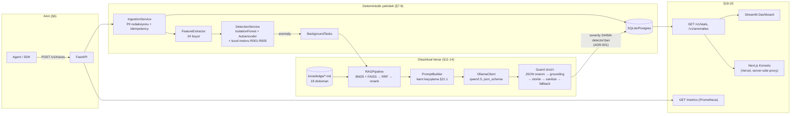

# AgentGuard AI

> AI agent yürütmelerinde anormal davranışı tespit eden, nedenini hibrit RAG +
> reranking ile araştıran ve yerel bir LLM (Qwen / Ollama) ile kanıta dayalı,
> yapılandırılmış bir soruşturma raporu üreten sistem.

Tam teknik tasarım için bkz. [`docs/TECHNICAL_PLAN.md`](docs/TECHNICAL_PLAN.md).

## Durum

Proje `docs/TECHNICAL_PLAN.md` §26 Yol Haritası'ndaki milestone sırasıyla
inşa ediliyor:

- [x] **M0 — İskelet**: repo, `pyproject.toml`, ruff/mypy/import-linter,
      pre-commit, CI iskeleti, `Settings`, `/health/live` + `/health/ready`.
- [x] **M1 — Veri & Şema**: Pydantic şemalar (trace/features/anomaly/
      investigation/knowledge), `POST /v1/traces` (+ `:batch`, `GET`),
      idempotency + PII redaksiyonu + saat çarpıklığı kontrolü,
      SQLAlchemy modelleri + Alembic migration, sentetik veri üretici
      (10k+ trace, 6 anomali tipi, hard negatives, zaman kayması, Markov
      araç geçişleri, KS testleriyle doğrulanmış).
- [x] **M2 — Özellikler & Baseline**: 24 boyutlu özellik çıkarıcı
      (`FEATURE_ORDER` tek doğruluk kaynağı), log1p/clip/scale dönüşüm
      hattı (dejenere — eğitimde sıfır varyanslı — sütunlar için kırpma
      otomatik devre dışı bırakılır), IsolationForest baseline, 5 kural
      motoru (R001-R005), ECDF normalizasyon + füzyon iskeleti, eşik
      seçimi (FPR≤%1 kısıtı), model registry + `manifest.json`
      (feature_version fail-fast kontrolü). `reports/eval_*.md`: 5-seed
      ortalamalı IsolationForest vs. rules-only karşılaştırması,
      tip bazlı recall ve bilinen sınırlılıklar (bkz. rapor).
- [x] **M3 — Autoencoder & Füzyon**: `TabularAE` (24→16→8→4→8→16→24),
      denoising eğitim (AdamW, ReduceLROnPlateau, early stopping),
      iki aşamalı temizlik (IF'in en anormal %1'i AE eğitiminden
      çıkarılır), ECDF kalibrasyon (AE için ayrı), füzyon ağırlıkları
      val setinde PR-AUC grid search ile seçilir, `reports/eval_*.md`:
      4 yapılandırma karşılaştırması (rules/IF/AE/Fusion+Rules, 5-seed
      ortalama). Dürüst bulgu: bu veri kümesinde tekil IsolationForest,
      test setinde füzyonu geçti (val/test genelleme farkı, rapora not
      düşüldü).
- [x] **M4 — RAG**: 18 dokümanlık bilgi tabanı (front-matter'lı;
      politika/failure-mode/runbook/incident, her `AnomalyType` en az
      birer runbook+incident+failure-mode ile kapsanıyor, CI'da
      doğrulanıyor), header-aware chunking (kod blokları atomik, min/max/
      overlap), BM25 + FAISS (`IndexFlatIP`) hibrit retrieval, RRF füzyonu
      + doküman-çeşitlendirme, cross-encoder reranker (eşik altı elenir,
      5'ten az dönebilir), deterministik sorgu inşası
      (`candidate_types` LLM'siz türetilir). `Embedder`/`Reranker`
      Protocol üzerinden enjekte edilir — gerçek modeller (`bge-m3`,
      `bge-reranker-v2-m3`) prodda/Docker'da ağ erişimiyle indirilir;
      testler deterministik fake'lerle çalışır (§1.5).
- [x] **M5 — LLM Soruşturma**: `OllamaClient` (httpx, retry+backoff,
      circuit breaker, warm-up, `format=json_schema`/`temperature=0`/
      `seed=42`), sistem+kullanıcı promptları (§21.1 injection savunması:
      kanıt blokları veri olarak işaretlenir, sahte `[T#]`/`[D#]`
      etiketleri ve delimiter taklitleri kaçışlanır), guard zinciri
      (JSON onarım → Pydantic doğrulama → grounding → otorite kontrolü →
      temizlik → fallback), `DetectionService`+`InvestigationService`,
      `POST /v1/traces` artık senkron tespit çalıştırıyor ve anomali
      durumunda `BackgroundTasks` ile soruşturmayı tetikliyor,
      `POST /v1/anomalies/{id}/investigate`, `GET /v1/investigations/{id}`
      (200/202/404), `GET /v1/jobs/{id}`. Ollama bu ortamda çalışmadığı
      için gerçek istemci `FakeLLMClient` ile test edildi (§22.3); uçtan
      uca akış (ingest→detect→soruşturma→persist→API) doğrulandı.
- [x] **M6 — Dashboard & Gözlemlenebilirlik**: gözlemlenebilirlik API'leri
      (`GET /v1/anomalies` severity/from/to/cursor filtreli, `GET /v1/stats`,
      `GET /v1/knowledge/search` retrieval debug, `POST /v1/knowledge/reindex`,
      auth-muaf `GET /metrics` Prometheus), `RAGPipeline.retrieve_debug()`
      (BM25/vector/RRF/rerank her aşamayı ayrı ayrı ifşa eder; `retrieve()`
      artık ona delege eder), 4 sayfalık Streamlit dashboard (Genel Bakış
      KPI'ları, Anomaliler, Soruşturma zaman çizelgesi, Retrieval debug,
      Model değerlendirmesi — yalnızca REST API'yi tüketir, ADR-006). Kritik
      bulgu: reindex arka plan görevi patch'lenmemiş `get_settings()`
      kullanıyordu ve paylaşılan `/nonexistent/artifacts/index` yoluna
      gerçek bir FAISS index yazıyordu; sonraki bağımsız bir test bu index'i
      gerçek `SentenceTransformerEmbedder` ile yükleyip ~55sn'lik gerçek
      HuggingFace ağ çağrısı retry'larına yol açtı — `monkeypatch.setenv` +
      `get_settings.cache_clear()` ile izole edildi. `streamlit.testing.v1.
      AppTest` betik dizinini `sys.path`'e eklemediği için tüm dashboard
      dosyalarına açık `sys.path.insert` eklendi.
- [x] **M7 — Sertleştirme & Dokümantasyon**: IP başına hız sınırlama
      (`slowapi`: ingest 60/dk, investigate 10/dk, RFC 9457
      `application/problem+json` 429 gövdesi), CORS yalnızca dashboard
      origin'ine kısıtlı, container'lar `read_only: true` + `tmpfs`
      (§21.3), RAG retrieval ablation raporu (24 sorguluk altın küme,
      `scripts/run_rag_eval.py`, BM25/vector/hybrid/hybrid+rerank
      karşılaştırması), uçtan uca prompt-injection snapshot testi (kanıt
      bloğundaki kaçışlama + grounding + otorite kontrolünün birlikte
      doğrulanması), bu README (mimari diyagram, sonuç tabloları,
      sınırlılıklar, DoD). Kritik bulgu: `slowapi`'nin
      `@limiter.limit()` dekoratörü, sarmalanan fonksiyonun değil kendi
      modülünün `__globals__`'ını taşıdığından, `from __future__ import
      annotations` açıkken FastAPI `Request`/`BackgroundTasks` gibi
      tipleri çözemeyip `PydanticUndefinedAnnotation` ile başlangıçta
      çöküyordu — postponed evaluation bu iki router dosyasında bilinçli
      olarak kapatılarak düzeltildi. Ayrıca `slowapi.Limiter`'ın modül
      düzeyinde tekil (singleton) olması testler arası sayaç sızıntısına
      yol açtı; `limiter.reset()` autouse fixture'ı ile izole edildi.
- [x] **M8 — Web Konsolu** (`frontend/`): Next.js 16 (App Router) +
      TypeScript + Tailwind v4, `next-themes` ile açık/koyu tema; 5 sayfa
      (Genel Bakış, Anomaliler, Soruşturma Detayı, Retrieval Debug, Model
      Sonuçları). Backend'e yalnızca sunucu tarafı Route Handler proxy'leri
      üzerinden bağlanır — `X-API-Key` tarayıcıya asla gönderilmez. Model/
      RAG sonuç sayfası derleme zamanında `reports/*.json`'ı statik olarak
      gömer (ADR-006 istisnası, M6'daki Streamlit sayfasıyla aynı gerekçe).
      Vercel'e "Root Directory: frontend" ile tek adımda deploy edilir,
      backend'in kendisi (torch/faiss bağımlılıkları nedeniyle) serverless'a
      taşınmaz. Playwright ile açık/koyu temada tüm sayfalar (taklit bir
      backend'e karşı) görsel olarak doğrulandı; `tsc --noEmit`, `eslint`,
      `next build` yeşil. Detaylar: [`frontend/README.md`](frontend/README.md).
      Marka: kullanıcı tarafından sağlanan logo kitiyle (Figma Make çıktısı)
      hizalanarak **AgentScope** olarak markalandı — `src/components/
      brand/{icon,wordmark}.tsx`, kitin SVG matematiğinin birebir portu,
      `currentColor` ile tema-duyarlı (ayrı açık/koyu asset yok); tasarım
      token'ları (`--accent`, `--cyan`) markanın Violet `#7C5CE4`/Cyan
      `#22D3EE` paletine, tipografi DM Sans + JetBrains Mono'ya güncellendi;
      favicon `app/icon.svg` olarak eklendi. Backend/API `agentguard` adını
      korudu — yeniden markalama yalnızca web konsoluna özgü.

## Mimari



Katman sınırları `import-linter` ile CI'da zorlanır: `api → services →
(anomaly | rag | llm) → features → schemas`; `schemas` hiçbir iç modüle
bağımlı değildir, `rag` asla `anomaly`'ye bağımlı olamaz.

## Hızlı başlangıç (geliştirme)

```bash
cp .env.example .env
python3 -m venv .venv && source .venv/bin/activate
pip install -e ".[dev]"
make bootstrap   # sentetik veri + model eğitimi + RAG index (idempotent)
make test        # ruff/mypy/import-linter'ı da çalıştırmak için: make lint
make dev         # http://localhost:8000/health/live
```

### GitHub Codespaces (yerel makinede RAM/kurulum derdi olmadan)

Repoda hazır bir `.devcontainer/` var — "Code" → "Create codespace on
`claude/project-plan-setup-coxx5t`" ile açıldığında Python 3.11 + Node.js
venv/`node_modules` otomatik kurulur (`post-create.sh`). Codespace
oluştururken makine tipini **en az 8GB RAM**'li seçin (ücretsiz kotanın
üstünde bir makine gerekebilir — GitHub hesabınızın planına bağlı).
Kurulum bitince terminalde çıkan iki yoldan birini izleyin:

- **Sadece arayüz** (ML modeli indirmez, saniyeler içinde ayakta):
  `cd frontend && npm run dev:fake-backend` + `npm run dev`
- **Gerçek backend** (ML modelleri indirilir, biraz sürer): `make bootstrap`
  + `make dev`, isteğe bağlı Ollama kurulumu (script çıktısında komutlar var)

Codespaces, `3000`/`8000`/`8501` portlarını otomatik forward eder — "PORTS"
sekmesinden veya otomatik açılan önizlemeden erişilir.

## Docker ile çalıştırma

```bash
make up    # api :8000, dashboard :8501, ollama :11434 (yalnızca iç ağ)
```

`docker compose up` akışı: `ollama` sağlıklı olunca `model-init` bir kereye
mahsus `qwen2.5:7b-instruct-q4_K_M`'i çeker, ardından `api` ve `dashboard`
ayağa kalkar. `api`/`dashboard` container'ları `read_only: true` ile
çalışır; yazılabilir tek yüzeyler `tmpfs` (`/tmp`, HF/streamlit cache) ve
adlandırılmış `artifacts` volume'üdür (§21.3).

> **Not — bu geliştirme ortamının kısıtı:** bu sandbox'ta Docker daemon'ı ve
> Hugging Face Hub'a ağ erişimi yok; `docker compose up` ve gerçek
> `bge-m3`/`bge-reranker-v2-m3`/Ollama akışı bu oturumda uçtan uca
> çalıştırılıp süre ölçülemedi (DoD'un "< 15 dk" maddesi doğrulanamadı —
> compose config'i `docker compose config` ile sözdizimsel olarak
> doğrulandı, CI'daki `docker` job'u `Dockerfile.api`'yi her push'ta
> derler). Gerçek bir makinede doğrulanması gerekir.

## Web Konsolu — AgentScope (`frontend/`, Vercel)

`dashboard/` (Streamlit, iç kullanım) yanında, aynı REST API'yi tüketen
**AgentScope** markalı, kurumsal görünümlü bir Next.js konsolu var —
Vercel'e tek tıkla deploy edilebilir. Marka: violet/cyan izleme-lensi
logosu, DM Sans + JetBrains Mono tipografi (bkz. `frontend/src/components/
brand/`); backend/API hâlâ `agentguard` adını taşır, yalnızca kullanıcıya
görünen web arayüzü AgentScope olarak markalanmıştır. Detaylar, sayfa
listesi ve Vercel kurulum adımları için bkz.
[`frontend/README.md`](frontend/README.md).

```bash
cd frontend
cp .env.local.example .env.local   # AGENTGUARD_API_URL / AGENTGUARD_API_KEY
npm install && npm run dev          # http://localhost:3000
```

Backend'in kendisi Vercel'de **çalıştırılmaz** — `torch`/`faiss`/
`sentence-transformers` serverless ortama uygun değildir; frontend yalnızca
backend'e sunucu tarafı bir proxy üzerinden bağlanır (`X-API-Key`
tarayıcıya asla sızmaz). Ekran görüntüleri: genel bakış, anomali listesi,
soruşturma detayı, retrieval debug ve model sonuçları sayfaları açık/koyu
temayı destekler.

## Backend'i kalıcı olarak host etme

Backend (torch + sentence-transformers + Ollama) Vercel gibi serverless
platformlara uygun değildir — kalıcı, en az ~6-8GB RAM'li bir sunucu
gerekir. İki doğrulanmış yol:

### Seçenek A — Oracle Cloud "Always Free" (ücretsiz, önerilen)

Oracle'ın süresiz ücretsiz katmanı, ARM Ampere mimarisinde 4 OCPU + 24GB
RAM'e kadar sunar — bu, 7B parametreli bir Ollama modelini bile rahatça
çalıştırmaya yeter.

1. https://signup.oraclecloud.com → hesap aç (kart doğrulaması ister,
   ücret kesilmez)
2. **Compute → Instances → Create Instance**: Image `Ubuntu 22.04`, Shape
   `VM.Standard.A1.Flex` (Ampere/ARM), OCPU `4`, Memory `24 GB`; SSH key
   çiftini oluştur ve indir
3. Sunucuya bağlan: `ssh -i anahtar.key ubuntu@SUNUCU_IP`
4. Kur ve klonla:
   ```bash
   sudo apt-get update && sudo apt-get install -y git python3.11 python3.11-venv
   curl -fsSL https://get.docker.com | sudo sh && sudo usermod -aG docker $USER && newgrp docker
   git clone https://github.com/ZEYDLCN/AgentScope.git && cd AgentScope
   cp .env.example .env   # AG_API_KEY'i güçlü bir değere değiştir (nano .env)
   ```
5. Backend bootstrap'ı host'ta çalıştır (`scripts/` prod imajına dahil
   değildir, bu adım host venv'i gerektirir):
   ```bash
   python3.11 -m venv .venv && source .venv/bin/activate
   pip install -e ".[dev]"
   make bootstrap
   ```
6. Tüm yığını ayağa kaldır (Ollama + API + Dashboard):
   ```bash
   docker compose -f docker/docker-compose.yml up --build -d
   curl http://localhost:8000/health/ready
   ```
7. Oracle Console'da **Security List**'e (Subnet → Security Lists → Add
   Ingress Rule, `0.0.0.0/0` → TCP `8000`) ve sunucunun kendi güvenlik
   duvarına (`sudo iptables -I INPUT -p tcp --dport 8000 -j ACCEPT`) `8000`
   portunu aç
8. Frontend'in (Vercel) `AGENTGUARD_API_URL`'ini
   `http://SUNUCU_PUBLIC_IP:8000` yap

### Seçenek B — Hugging Face Spaces (PRO abonelik gerektirir)

Hugging Face artık Docker Space'leri yalnızca PRO planında sunuyor
(Static Space'ler ücretsiz kalmış). PRO hesabın varsa
[`deploy/huggingface/`](deploy/huggingface/README.md) klasöründeki tek
container'lı Dockerfile + `entrypoint.sh` ile Oracle'dan çok daha az
sürtünmeli bir kurulum mümkün (yalnızca `git push`) — kalıcı disk
olmadığından her soğuk başlangıçta bootstrap'ın (idempotent) yeniden
çalıştığını unutma.

## API özeti

Tam liste ve sözleşme kuralları için `docs/TECHNICAL_PLAN.md` §16.

| Method | Path | Not |
|---|---|---|
| `POST` | `/v1/traces` | Rate limit: 60/dk/IP |
| `POST` | `/v1/traces:batch` | ≤100 trace, `207 Multi-Status` |
| `GET` | `/v1/traces/{id}` | |
| `GET` | `/v1/anomalies` | severity/from/to/cursor/limit filtreli |
| `POST` | `/v1/anomalies/{id}/investigate` | Rate limit: 10/dk/IP (idempotent) |
| `GET` | `/v1/investigations/{id}` | 200/202/404 |
| `GET` | `/v1/jobs/{id}` | |
| `POST` | `/v1/knowledge/reindex` | admin |
| `GET` | `/v1/knowledge/search?q=` | debug retrieval |
| `GET` | `/v1/stats` | dashboard özeti |
| `GET` | `/health/live`, `/health/ready` | auth muaf |
| `GET` | `/metrics` | auth muaf, Prometheus |

Auth: `X-API-Key` header (`/health` ve `/metrics` hariç tüm uçlar). CORS:
yalnızca `AG_CORS_ORIGINS`'te tanımlı origin'(ler).

## Sonuçlar

### Anomali tespiti (`reports/eval_*.md`, 5-seed ortalama)

| Model | PR-AUC | ROC-AUC | Recall@τ | FPR@95TPR | F1 |
|---|---|---|---|---|---|
| Rules only | 0.3070 | 0.5582 | 0.1164 | 1.0000 | 0.2085 |
| IsolationForest | 0.8327 ± 0.0027 | 0.8877 ± 0.0018 | 0.6142 ± 0.0021 | 0.7403 ± 0.0236 | 0.7470 ± 0.0014 |
| Autoencoder | 0.7921 ± 0.0022 | 0.8518 ± 0.0036 | 0.6116 ± 0.0058 | 0.7575 ± 0.0214 | 0.7400 ± 0.0059 |
| Fusion + Rules | 0.7921 ± 0.0022 | 0.8518 ± 0.0036 | 0.6116 ± 0.0058 | 0.7575 ± 0.0214 | 0.7400 ± 0.0059 |

Tip bazlı recall (IsolationForest, seed=42): `api_abuse` 1.00, `tool_loop`
0.99, `token_spike` 0.18, `unusual_tool_sequence` 0.08, `permission_violation`
0.00, `prompt_injection` 0.00 — bu son iki tip normal dağılımda yalnızca
**tek** bir özelliği oynatır (bkz. Sınırlılıklar). Güncel rapor: en son
`reports/eval_*.md`.

### RAG retrieval ablation (`reports/rag_eval_*.md`, 24 sorguluk altın küme)

| Yapılandırma | Recall@5 | Recall@20 | nDCG@5 | MRR@5 |
|---|---|---|---|---|
| Sadece BM25 | 0.9375 | 1.0000 | 0.7977 | 0.7639 |
| Sadece Vector | 0.5417 | 1.0000 | 0.4468 | 0.3861 |
| Hybrid (RRF) | 0.8333 | 1.0000 | 0.6825 | 0.6125 |
| Hybrid + Reranker | 0.7917 | 0.7917 | 0.7014 | 0.6597 |

> Bu rakamlar, ağ erişimi olmayan bu ortamda deterministik "fake"
> (bag-of-words hash) embedder/reranker ile üretildi — gerçek
> `bge-m3`/`bge-reranker-v2-m3` ile mutlak sayılar değişecektir; ayrıca
> Jaccard-tabanlı fake reranker, gerçek cross-encoder'ın anlamsal ayrımını
> göstermez ("Hybrid + Reranker"in "Sadece BM25"i geçememesi bunun bir
> yansımasıdır, gerçek modelle beklenmez). `--real` bayrağıyla prod
> modelleriyle yeniden üretilmelidir; kanıt değeri mutlak sayılardan çok
> pipeline'ın uçtan uca çalıştığının gösterilmesidir.

## Sınırlılıklar (dürüstçe)

- **Sentetik veri:** tüm anomali tespiti eğitimi/değerlendirmesi
  `scripts/generate_synthetic.py` ile üretilen sentetik trace'lere
  dayanır; gerçek prodüksiyon trafiğinde dağılım kayması beklenir.
- **Tek-agent kapsamı:** özellik seti ve kurallar tek bir agent'ın tek bir
  trace'i düzeyinde çalışır; çoklu-agent orkestrasyon/işbirliği anomalileri
  (§v2) kapsam dışıdır.
- **CPU latency:** bu ortamda gerçek `bge-m3`/reranker/Ollama modelleri
  hiç çalıştırılamadı (ağ erişimi yok) — gerçek p50/p95 uçtan uca
  soruşturma gecikmesi ölçülmedi; §25 performans bütçesi teorik kalıyor.
- **`permission_violation`/`prompt_injection` recall'ı düşük:** bu iki tip
  normal dağılımda tek bir özelliği oynatan anomalilerdir; genel amaçlı
  tabular outlier detector'lar (IF/AE) çok-özellikli sapmaları (tool_loop,
  api_abuse) çok daha kolay yakalar. Kurallar (R002/R005) bu boşluğu tip/
  severity ataması ile kapatır ama R001 dışında sayısal skora katkı vermez.
- **Füzyon her zaman kazanmıyor:** test setinde tekil IsolationForest,
  füzyonu (val setinde seçilen ağırlıklarla) geçti — küçük val setinde
  ağırlık seçiminin aşırı uyum riski taşıdığının bir göstergesi.
- **RAG ablation raporu fake embedder ile üretildi** (yukarıdaki not) —
  mutlak sayılar değil, göreli pipeline davranışı kanıt değeri taşır.
- **`docker compose up` uçtan uca doğrulanmadı** — bu sandbox'ta Docker
  daemon'ı yok; yalnızca `docker compose config` ile statik doğrulama ve
  CI'daki image build'i yapıldı.
- **`pip-audit` build'i kırmıyor** (bilinçli, §CI): torch/transformers/
  streamlit/starlette/pillow gibi ML ekosistemi bağımlılıklarında bilinen
  CVE'ler var; major sürüm atlamaları bu ortamda embedding/reranker
  modelleriyle uçtan uca doğrulanamadığından riskli — CI, raporu artefakt
  olarak saklar (`pip-audit-report.json`) ama build'i kırmaz. v2'de
  kontrollü bir bağımlılık yükseltme turu planlanmalı.
- **Demo kaydı yok** — bu ortamda ekran kaydı/GIF üretilemedi; yerine
  yukarıdaki mimari diyagram ve sonuç tabloları konuldu.
- **`frontend/` gerçek bir Vercel projesine deploy edilip canlıda
  doğrulanmadı** — bu sandbox'ta Vercel hesabı/CLI erişimi yok. Yerine:
  `next build` production derlemesi başarıyla tamamlandı, `tsc --noEmit`/
  `eslint` temiz, ve tüm sayfalar açık/koyu temada gerçekçi sabit veri
  döndüren bir taklit backend'e (`frontend/scripts/fake-backend.py`) karşı
  Playwright ile görsel olarak doğrulandı.

## Definition of Done (§28)

- [x] `POST /v1/traces` → tespit → (anomali ise) soruşturma → dashboard
      akışı uçtan uca çalışıyor — testlerde fake LLM/embedder ile (§22.3),
      **ayrıca** GitHub Codespaces üzerinde gerçek Ollama (`qwen2.5:
      1.5b-instruct`, RAM kısıtlı ortam) ile canlı olarak doğrulandı. Bu
      canlı testte gerçek bir prod hatası bulunup düzeltildi:
      `?force=true` ile yeniden soruşturma, `InvestigationRecord.trace_id`
      UNIQUE kısıtına çarpıp sessizce başarısız oluyordu
      (`InvestigationRepository.upsert()` ile düzeltildi, regresyon testi
      eklendi).
- [x] `reports/`'ta 4 yapılandırmalı (rules/IF/AE/fusion) 5-seed model eval
      raporu.
- [x] `reports/`'ta 4 yapılandırmalı (BM25/vector/hybrid/hybrid+rerank)
      retrieval ablation raporu.
- [x] Test coverage ≥ %80 (CI kapısı: `--cov-fail-under=80`), CI'nın tüm
      işleri yeşil.
- [x] Şema geçerlilik oranı guard zinciriyle garanti; her `Investigation`
      yalnızca kaynaklı kanıt içeriyor (grounding testi geçiyor).
- [x] Prompt injection payload'lı fixture ile güvenlik snapshot testi geçiyor
      (`tests/integration/test_security_injection.py`).
- [x] README: problem tanımı, mimari diyagram, hızlı başlangıç, sonuç
      tabloları, sınırlılıklar bölümü.
- [x] Sınırlılıklar dürüstçe yazılmış (yukarıda).
- [ ] `git clone` → `make bootstrap` → `docker compose up` < 15 dk (temiz
      makinede doğrulanmadı — bu sandbox'ta Docker daemon'ı yok).
- [ ] Demo kaydı (bu ortamda ekran kaydı üretilemedi).

## Tasarım ilkeleri (özet)

1. Deterministik çekirdek, olasılıksal kenar — LLM karar vermez, yalnızca açıklar.
2. Kanıtsız cümle yok — her `evidence` maddesi trace veya doküman kaynaklı olmalı.
3. Kontratlar önce — modül sınırları Pydantic v2 ile tanımlanır.
4. Tek yönlü bağımlılık: `api → services → (anomaly | rag | llm) → schemas`.
5. Yerel-öncelik — embedding, reranker ve LLM tamamen yerel çalışır.

Detaylar için `docs/TECHNICAL_PLAN.md` §1'e bakın.
